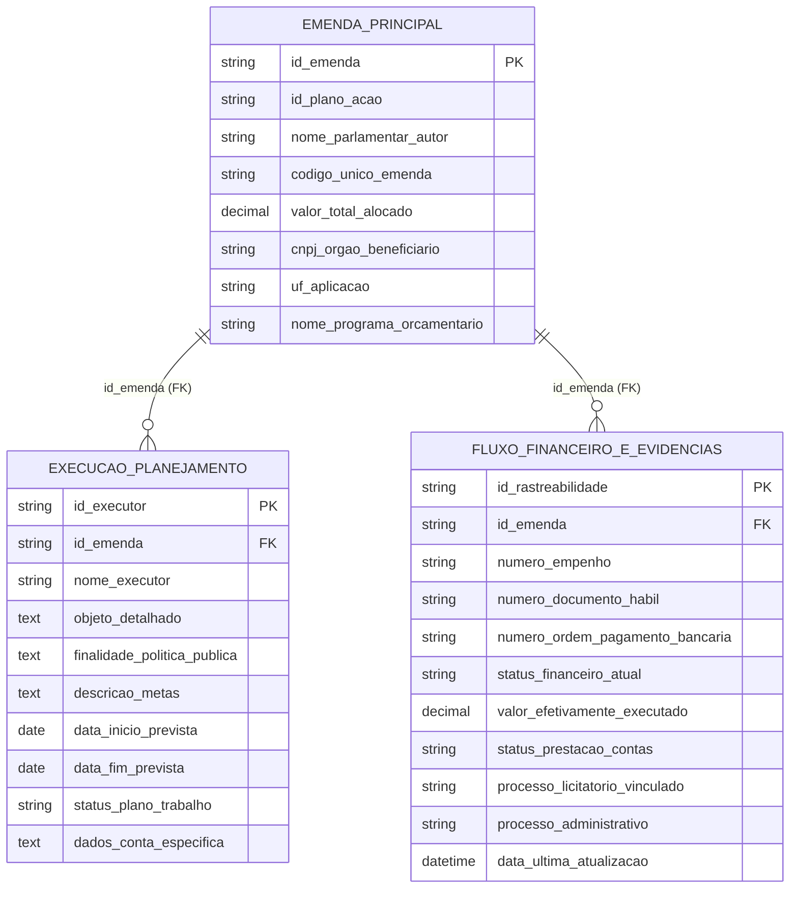
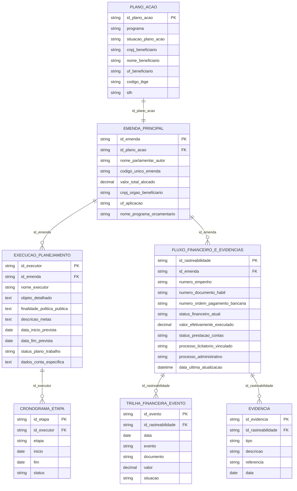

# DER / ERD — Protótipo de Transparência (RN nº 19/2025 e TAEP)

Este documento descreve o **Modelo Entidade-Relacionamento** do leiaute simplificado, com foco nas 3 tabelas:

1. **EMENDA_PRINCIPAL** (Origem e Alocação)  
2. **EXECUCAO_PLANEJAMENTO** (Objeto, Finalidade, Metas e Cronograma)  
3. **FLUXO_FINANCEIRO_E_EVIDENCIAS** (Rastreabilidade e Status)  

## DER (mínimo — 3 tabelas)

> Observação: o campo `id_plano_acao` aparece como atributo em `EMENDA_PRINCIPAL` para rastreabilidade; se você quiser “formalizar” `PLANO_ACAO` como entidade, veja o DER normalizado abaixo.

## DER (normalizado — recomendação para listas/itens repetidos)

No protótipo (`data.js`) existem listas como:
- **cronograma** (várias etapas)
- **trilha_financeira** (vários eventos)
- **evidencias** (vários anexos/registros)

Em um banco relacional, isso normalmente vira tabelas filhas:

## Como visualizar

Se seu viewer de Markdown suporta Mermaid, o diagrama renderiza automaticamente.  
Caso contrário, cole o bloco Mermaid em um editor Mermaid (ex.: Mermaid Live Editor).

